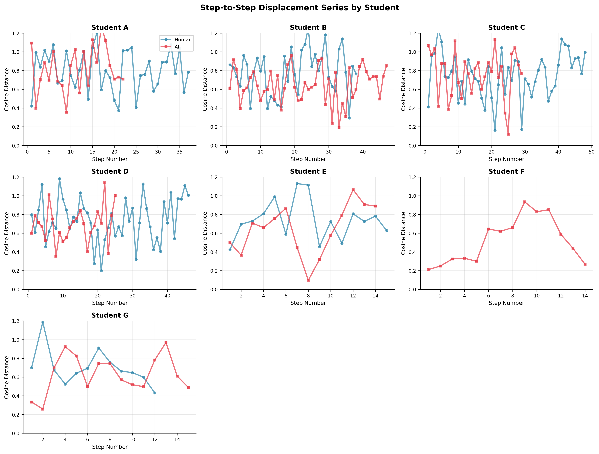
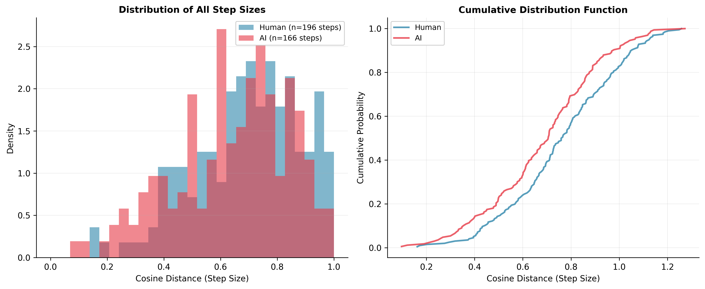
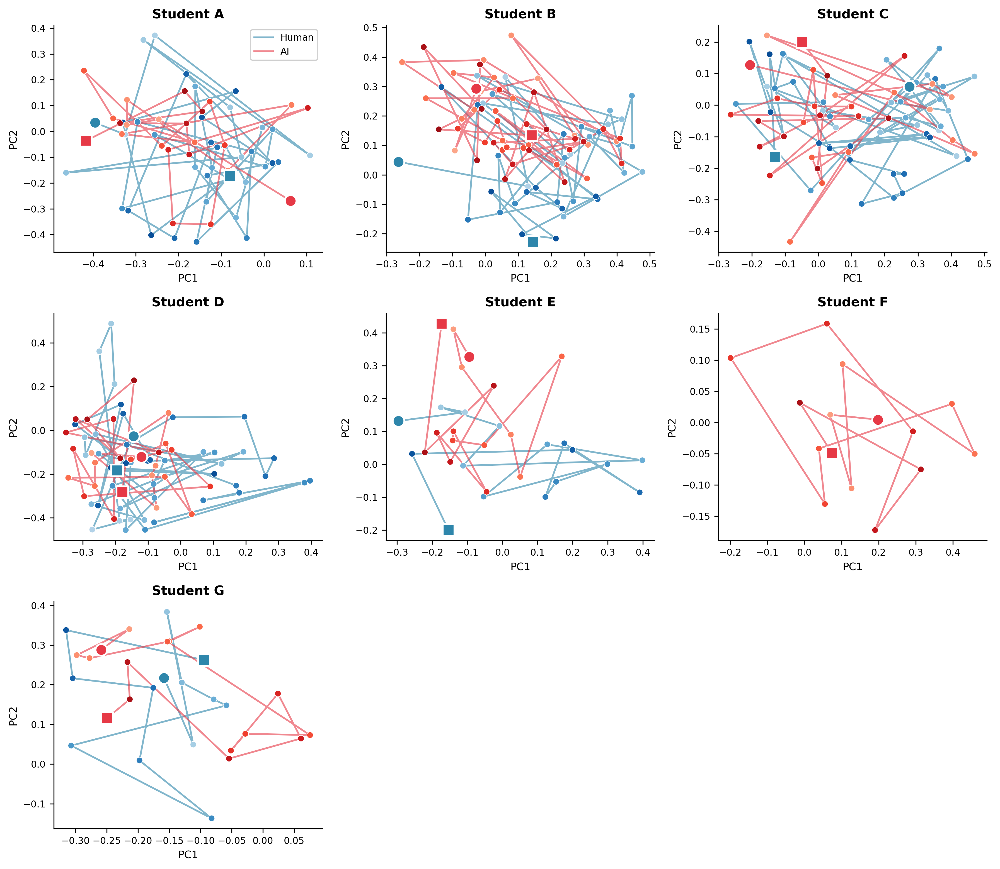
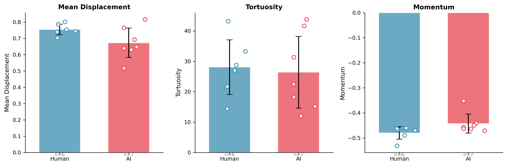
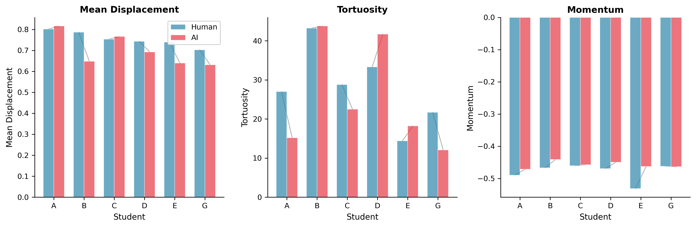
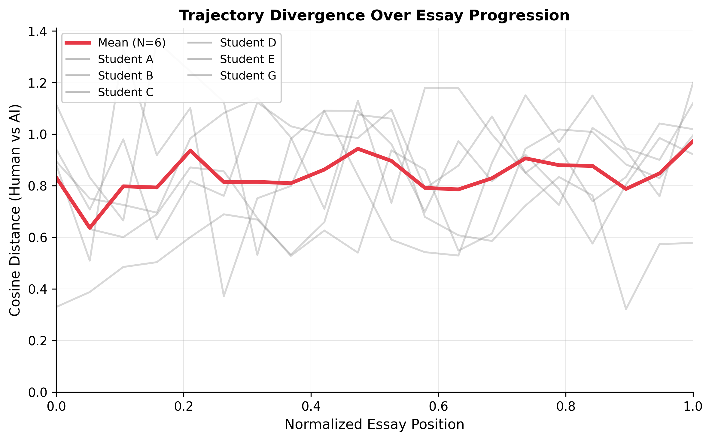
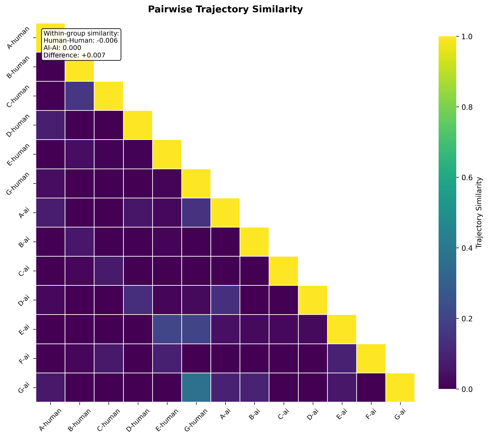
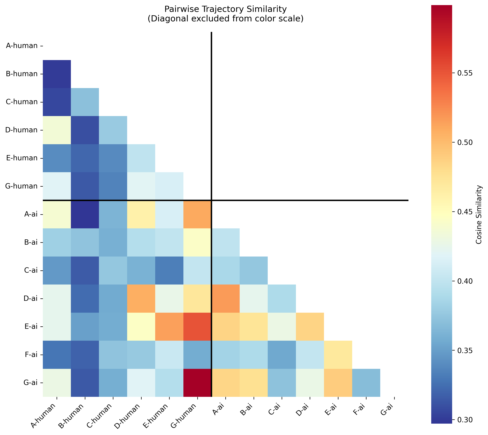

# Essay Trajectory Analysis: Results

**Comparing human process essays vs. AI-generated essays from blind prompts**

---

## Method

Seven doctoral students wrote essays about thinking over 5 days. On Day 2, each captured their intentions in a "blind prompt." On Day 5, that prompt was submitted to an LLM to generate an AI essay from the same seed. We compare the **argumentative trajectories** through semantic space.

### Pipeline

1. **Chunking**: Each essay segmented into sequential argumentative moves
2. **Cleaning**: Each chunk summarized to isolate logical structure, removing references and semantic elaboration
3. **Embedding**: Chunks embedded using sentence-transformers (all-MiniLM-L6-v2, 384-dim)
4. **Metrics**: Computed trajectory characteristics using cosine distance

### Trajectory Metrics

**Displacement**: Cosine distance between consecutive chunk embeddings
- Mean displacement: average step size
- Displacement variance: uniformity of steps
- Max displacement: largest single jump

**Tortuosity**: Path efficiency = `sum(displacements) / endpoint_distance`
- Value of 1.0 = perfectly direct
- Higher values = more wandering

**Momentum**: Directional consistency = average cosine similarity between consecutive direction vectors
- High momentum = consistent conceptual direction
- Low momentum = frequent direction changes

**Divergence curve**: Position-matched distance between human/AI trajectories (interpolated to 20 points)

**Homogeneity (Pairwise trajectory similarity)**: To compare trajectories of different lengths, each trajectory is interpolated to a common number of points (20), then flattened to a single vector (20 × 384 = 7,680 dimensions). Similarity between two trajectories is computed as cosine similarity between their flattened vectors. This captures overall trajectory shape while allowing comparison across essays of different lengths.

---

## Results

### Sample Sizes

- **Human essays**: 6 (students A-E, G)
- **AI essays**: 7 (students A-G)
- **Total chunks**: 375 (247 human, 128 AI after cleaning)

### Displacement Patterns

*Figure: Step-to-step displacement across essay trajectories*

*Figure: Distribution of displacement magnitudes by source*

*Figure: Summary statistics (mean step size, variance, max jump). See [Annex Table](annex_figures/displacement_summary_table.tex) for LaTeX-formatted version.*

**Summary Statistics:**

| Source | Mean Step Size | Step Variance | Max Jump |
|--------|---------------|---------------|----------|
| Human  | 0.65 (±0.11)  | 0.051 (±0.010) | 1.13 (±0.15) |
| AI     | 0.62 (±0.12)  | 0.048 (±0.013) | 1.04 (±0.09) |

Human essays show slightly larger steps and more variation, but differences are modest.

### Trajectory Metrics by Essay

| Student | Source | Chunks | Mean Disp | Tortuosity | Momentum |
|---------|--------|--------|-----------|------------|----------|
| A       | Human  | 38     | 0.80      | 27.0       | -0.49    |
| A       | AI     | 23     | 0.82      | 15.2       | -0.47    |
| B       | Human  | 39     | 0.79      | 43.2       | -0.47    |
| B       | AI     | 48     | 0.65      | 43.8       | -0.44    |
| C       | Human  | 49     | 0.75      | 28.8       | -0.46    |
| C       | AI     | 30     | 0.77      | 22.5       | -0.46    |
| D       | Human  | 47     | 0.74      | 33.3       | -0.47    |
| D       | AI     | 26     | 0.69      | 41.7       | -0.45    |
| E       | Human  | 16     | 0.74      | 14.4       | -0.53    |
| E       | AI     | 15     | 0.64      | 18.2       | -0.46    |
| G       | Human  | 13     | 0.70      | 21.7       | -0.46    |
| G       | AI     | 16     | 0.63      | 12.1       | -0.46    |
| F       | AI     | 15     | 0.52      | 31.3       | -0.35    |

### Trajectory Visualizations

*Figure 1: PCA projection of essay trajectories. Each subplot shows one student's human (blue) and AI (orange) trajectories through semantic space. Points are sequential chunks; lines show trajectory path.*

### Metric Comparisons

*Figure 2: Distribution of trajectory metrics by source*

*Figure 2b: Paired comparison showing per-student differences. Lines connect matched pairs.*

**Key observations:**
- **Tortuosity**: High variability within both groups; no clear pattern
- **Momentum**: Consistently negative (frequent direction changes) for both human and AI
- **Displacement**: Human essays tend toward slightly larger, more variable steps

### Divergence Over Essay Position

*Figure 3: Cosine distance between human and AI trajectories at matched positions (0 = start, 1 = end). Thin lines = individual students; thick line = mean.*

**Pattern**: Divergence does not systematically increase. Human and AI trajectories remain distinct but parallel throughout, suggesting the blind prompt establishes a semantic region both remain within.

### Homogeneity (Inter-Essay Similarity)

<!--  -->

**Alternative visualization**: 

*Figure 4: Pairwise trajectory similarity (cosine). Essays grouped by source. Darker = more similar.*
Emphasizes off-diagonal patterns by setting vmax to the maximum off-diagonal value rather than 1.0.

**Method**: Each trajectory interpolated to 20 points, flattened to a 7,680-dimensional vector (20 positions × 384 embedding dimensions), then pairwise cosine similarity computed between all essay pairs.

**Pattern**: Visual inspection suggests modest clustering by source (AI essays show slightly more within-group similarity), but substantial variation exists within both groups. Individual student differences appear stronger than source differences.

---

## Interpretation

### Hypotheses Tested

1. **AI essays are more direct** (lower tortuosity, higher momentum): **Not supported**. Both groups show high tortuosity and low momentum. AI trajectories wander as much as human ones.

2. **Human essays are more varied** (higher displacement variance): **Weakly supported**. Human essays show slightly larger mean steps and max jumps, but overlap is substantial.

3. **Divergence increases over the essay**: **Not supported**. Divergence curves are relatively flat, suggesting human and AI trajectories remain equidistant throughout.

4. **AI essays are more homogeneous**: **Inconclusive**. Visual inspection of similarity matrix shows modest source clustering but high within-group variation.

### Limitations

- **Small N** (6-7 paired essays): Patterns are descriptive, not inferential
- **Chunk cleaning trade-off**: Summarization removes semantic noise but may also remove meaningful trajectory signals
- **Embedding model**: Local model (all-MiniLM-L6-v2) may not capture all relevant semantic structure
- **PCA projection**: 2D visualization loses information from 384-dim space

### Key Finding

**The blind prompt method does not produce systematically diverging trajectories.** Human process essays and AI essays from the same prompt occupy similar regions of semantic space and follow comparably tortuous paths. This suggests:
- The blind prompt strongly constrains the argumentative space
- Five days of human elaboration does not escape that constraint
- OR: Cleaned logical structure is too coarse to detect divergence that exists at the semantic level

---

## Data Availability

- **Metrics**: [output/data/metrics/essay_metrics.csv](output/data/metrics/essay_metrics.csv)
- **Similarity matrix**: [output/data/metrics/similarity_matrix.csv](output/data/metrics/similarity_matrix.csv)
- **Embeddings**: `output/data/embeddings/`
- **Cleaned chunks**: `output/data/chunks_cleaned/`

---

## References

Nour, M. M., et al. (2025). Charting trajectories of human thought using large language models. *Nature Human Behaviour*. (VECTOR framework / Cinderella paper)
